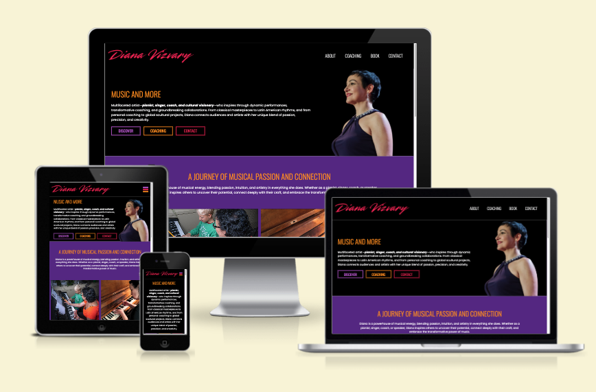
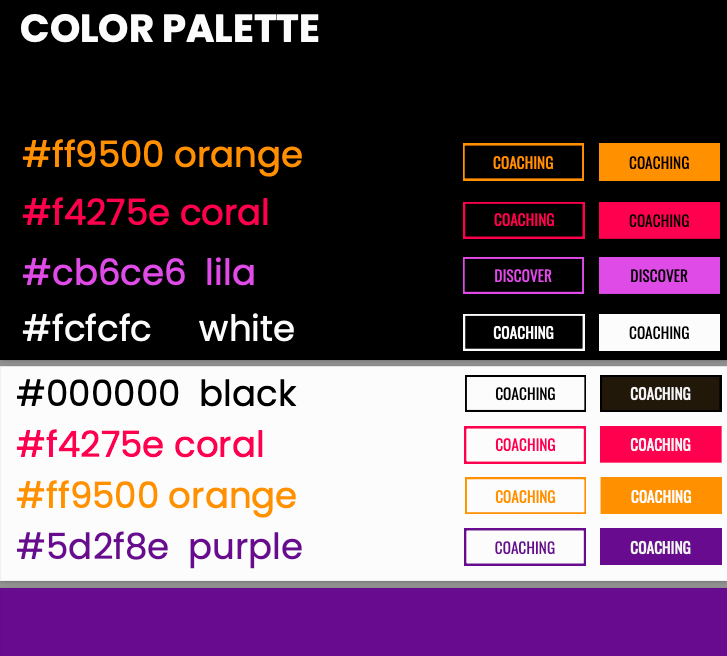
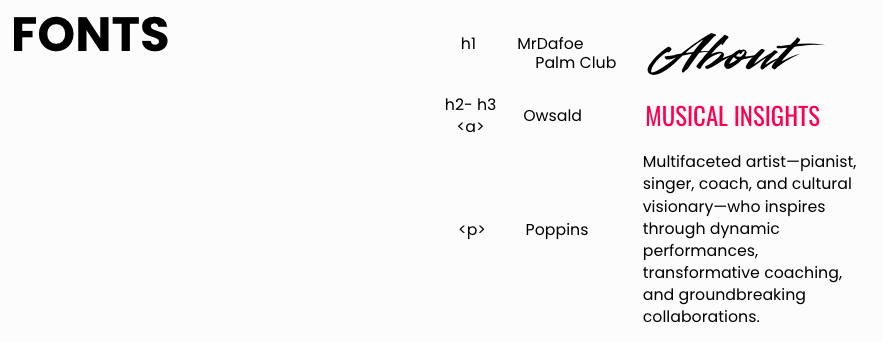
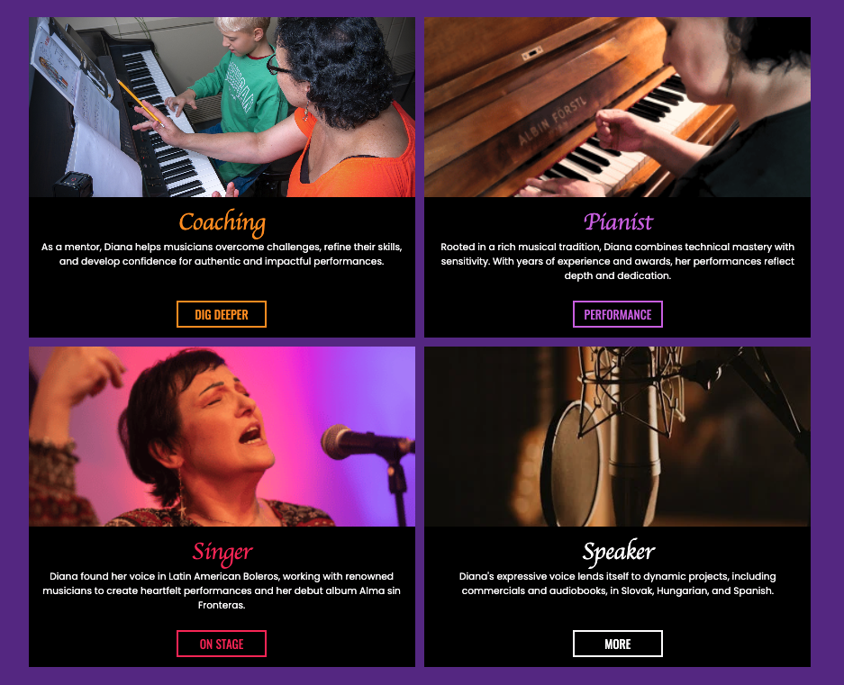
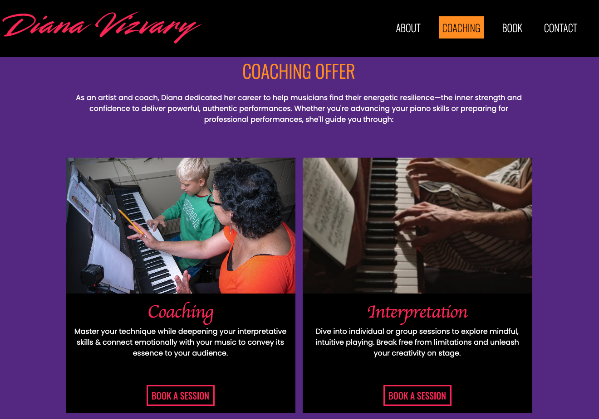
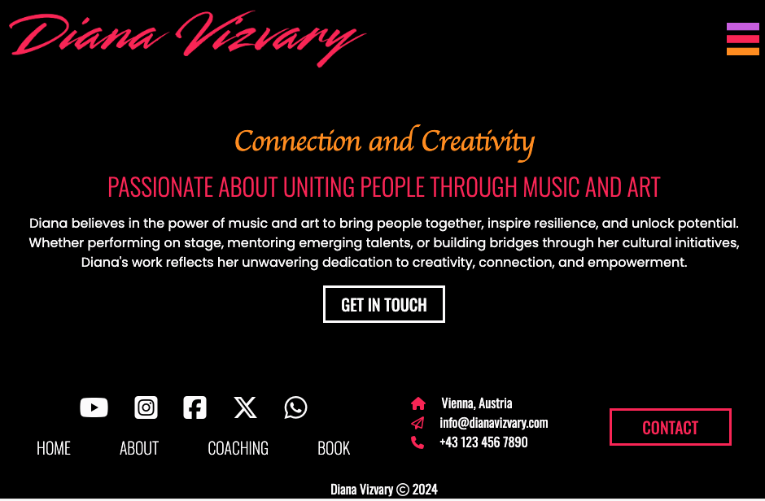

## Welcome to Diana Vizvary's Website 

### The artistic portfolio of Diana Vizvary, a multifaceted artist and musician.

[Visit Live Page](https://iliana-marquez.github.io/diana-vizvary/index.html)

The main goal of this website is to present Diana's Artistic Profile to new users and regular community members, keeping them updated on her artistic journey. It also provides opportunities to access Diana's services as a musician and music mentor.

This website was mobile-first designed to ensure a user-friendly navigation experience across all device sizes, considering that many of Diana's users will likely visit on mobile devices.

# UI/UX

The website's architecture was based on Diana's user stories:

- As a first-time visitor, I want easy navigation and user-friendly design to seamlessly learn about Diana Vizvary: who she is, what she does, what she offers, and how to contact her.

- As someone interested in Diana, I want to explore her services and artistic achievements to decide how to engage.

- As a musician, I want to book coaching sessions to improve my skills.

- As a collaborator, I want to learn about Diana's cultural initiatives and inquire about future collaborations.

- As a visitor,  I want to contact Diana directly to inquire about her services or events.

- As a visitor, I want to easily find Diana's contact information and social media links to reach out to her through multiple channels.

### Design

The design reflects Diana's energetic and colorful personality, translated into colors that tell her story and represent her music processes:

- Color Palette

    - Diana the Artist and her direct insights = Red (passion).
    - Coaching = Orange (result of the energy burst of the coaching process).
    - Services = Purple (resilence and wisdom built on decades of experience).
    - Cultural Initiatives = White (the presence of all the colors to enlighten musical collaboratios in all ways). 

    

- Typography

    - MrDafoe / Palm Clup: Cursive main titles to create a handwritten feel and personal connection with users.
    - Oswald: Block main titles that convey Diana's structured musical approach.
    - Poopins: A wide, easy-to-read font for general content that enhances clarity and engages users with Diana's insights.

    

# Features

- Navigation
    - Fixed at the top for constant accessibility.
    - Resposonsive design:
        - Dropdown navbar for small and medium devices:
        
        - Static navbar on larger devices with active-link classes for page orientation.
        
    
- Main Section:
    - Hero section highlighting Diana’s musical abilities with clear CTAs on the homepage.
    

    - Services section featuring Diana's offerings with responsive card layout.
    

    - Interactive, clickable elements for easy navigation throughout the site.
    

    - Contact and booking forms for user engagement
    
    

- Footer 
    - Responsive design displaying Diana's information and navigation links.
    - Includes links to Diana’s social media and other sections of the site for easy navigation.
    

# Technologies Used 

- Languages: 
    - HTML5
    - CSS

- Libraries:
    - Bootstrap 5.3.3: To speed up the process of creating responsive sections throughout the site.
    - Google Fonts: To use the three main choices of the website's design.
    - Font Awesome: Use of icons for intuitive contact information and socialmedia display.

- Programs:
    - Git: For version control.
    - GitHub: For storing and deploying the project. 
    - Canva: For wireframes' design and custom website elements such as backgroundless hero images.

# Testing

- W3C:
    - HTML Valdation:
        - index.html: Document checking completed. No errors or warnings to show.
        - about.html: Document checking completed. No errors or warnings to show.
        - coaching.html: Document checking completed. No errors or warnings to show.
        - booking.html: Document checking completed. No errors or warnings to show. (After removing type="button" to a tag in modal on booking & contact.html)
        - contact.html: Document checking completed. No errors or warnings to show. (After removing type="button" to a tag in modal on booking & contact.html)

    - CSS Validation:
                     Warnings (7)
             URI : TextArea
             1		Imported style sheets are not checked in direct input and file upload modes
             28		Due to their dynamic nature, CSS variables are currently not statically checked
             33		Due to their dynamic nature, CSS variables are currently not statically checked
             37		Due to their dynamic nature, CSS variables are currently not statically checked
             66		Due to their dynamic nature, CSS variables are currently not statically checked
             192	Due to their dynamic nature, CSS variables are currently not statically checked
             359	Due to their dynamic nature, CSS variables are currently not statically checked

- Lighthouse:
    - index.html: 
        - Performance: 97
        - Accesibility: 95
        - Best Practices: 100
    - about.html: 
        - Performance: 98
        - Accesibility: 95
        - Best Practices: 100
    - coaching.html: 
        - Performance: 99
        - Accesibility: 100
        - Best Practices: 100
    - booking.html:  
        - Performance: 100
        - Accesibility: 100
        - Best Practices: 100
    - contact.html: 
        - Performance: 98
        - Accesibility: 100
        - Best Practices: 100

- Testing User Stories from User Experiences:
    - Currently being compiled.

- Browsing:
    - Tested on Chrome, Safari, Firefox, and Edge.

- Devices:
    - Huawei-Pro, Iphone 13

- Known bugs to be fixed shortly:
    - On iPhone 13, the phone number in the footer overlaps the email line, obstructing visibility.
    - The MrDafoe font does not render correctly in some desktop browsers.
    - HTML form validation does not work with modal confirmations unless JavaScript is implemented.

### Overcomed challenges:

   - Development of responsive navbar section with minimal amount of html code and one js function.
   - Succesfull image rendering after applying relative paths throughout css background images.
   - Designed and optimized responsive hero sections on the Home and About pages by using appropriate CSS background properties and tailored media queries, ensuring responsiveness across all devices.
   - Streamlined CSS with Variables: Declared root CSS variables for titles and custom button classes, enabling consistent and efficient styling throughout the project.

### Future improvements:

- Add features to to support additional user stories and business goals:
    - Feedback Section.
    - Multimedia pages showcasing Diana's work.
    - Newsletter sign-up or blog.
    - Booking with calender tool.

- Implement dymamic animations througout the project.

# Credits

### Code

- Bootstrap 5 library usage of the grid system for responsive leayout and styling classes in a responsive way thoughout key responsive elements. 

- Boardwalk-Games follow along project in Code Instute for the following great ideas:
    - Adding the propper boilerplates based in a responsive bootstrap gridsystem to make the development of responsive sections more efficient.
    - Linking CSS after Bootstrap in the meta tag to be able to custom bootstrap sections, like forms in this projects with the .sharp-corners custom css class, applied with the * card in an efficient way.

- Love-Running follow along project in Code Institute for the set up of a fixend navbar and Boardwalk-games project for the setting of the flex custom class for the body to set the main content underneath in a very efficient way. 

### Content

- Diana Vizvary musical carreer insights and businessgoals for the design of this website and its further developing for a future commercial use.
- All content was written by the developer in collaboration with Diana Vizvary, the artist presented in the website. 

### Acknowledgments 

- Code Institute for guidance on foundational development processes, version control, and documentation.
- Code-Institute-Solutions for providing a sample README as a reference.

